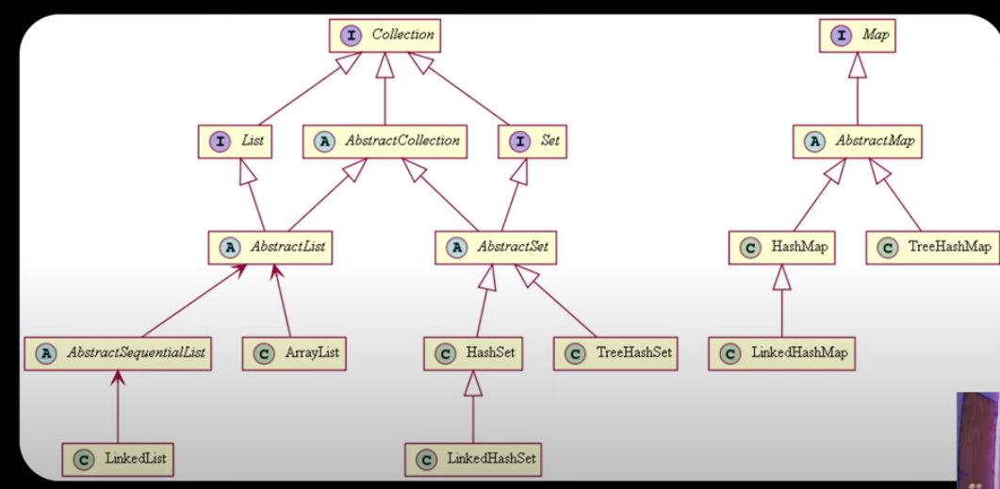
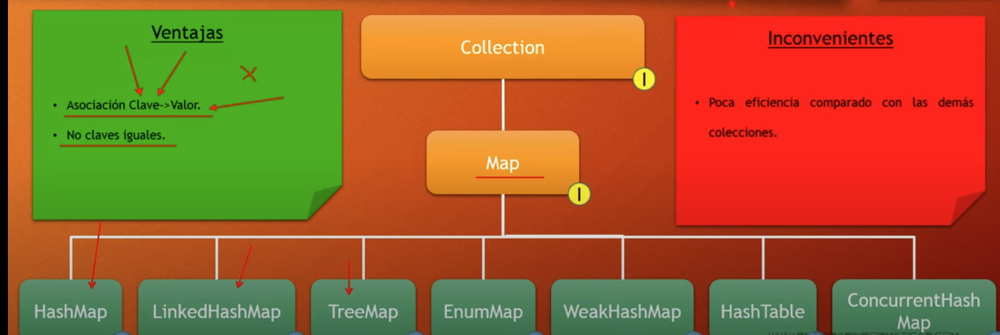
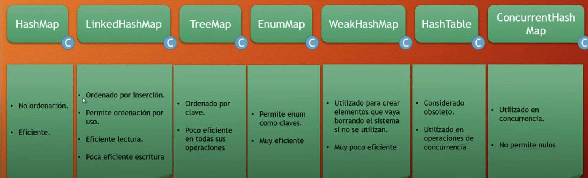

## Colecctions

Las **Colecciones** son estructuras _similares a los arreglos_ pero con la principal caracteristica de que son dinamicos (su tamaño y cantidad de elementos puede variar en el tiempo)

En **Java** se emplean mediante la interfaz **_"Collection"_** que permite implementar una serie de metodos comunes como ser: añadir, eliminar, obtener el tamaño de la colecccion etc.

Tenemos las prinicpales
- List
    - LinkedList
    - ArrayList
- Map
    - HashMap
    - TreeHashMap
    - LinkedHashMap
- Set
    - HashSet
    - LinkedHasstSet
    - TreeHastSet
- Queue

De la interfaz collection tenemos disintos tipos que se implementan.
Los maps no osn parte de las coelccion porque no implementan la interfaz.

### Lists

Las _Listas_ son un **conjunto de elementos relacionados entre si** que tienen un determinado **orden**.
Su tamaño es _dinamico_.
    - ArrayLists (FIFO)
    - LinkedLists (FIFO)
    - Stack (LIFO)

Pueden tener dos tipos de orden **FIFO** (_First In First Out_) y tenemos **LIFO** (_Last In First Out_).
#### ArrayList
Es una clase que se representa como una matriz dinamica que permite almacenar elementos. Hereda de la clase AbstractList, la cual implementa la interfaz List. Permite colecciones o elementos duplicaods. El orden de los registros es el orden el que fueron insertados. Permite acceso aleatorio (tiene indice). Manipulación lenta (recorrer todooodo el arraylist para hacer un cambio)

#### LinkedLists
Es una clase, representan a una lista doblemente enlazada (ida y vuelta). Permite duplicados, mantiene el orden de insercción. Manipulación más rapida. Puede ser usada/tratada no solo como lista, sino también como pila, o como cola. Permite hacer inserciones o eliminaciones al principio o al final de la colección (por eso es que puede ser tratado como una pila o una cola)

### Maps
Tiene ventjas a la hora de alamcenar informacion ya que es posible asociar cada valor con una clave (_key_) correspondiente. Dentro de los _Maps_ Hay varias opciones

Aqui la caracteriscisas de cada uno

Al construir cualquier mapa se debe tener encuenta que la interfaz recibe todos tipos genericos como paramtreos ´Map >k,p>´. Existen algunnos metodos 
- put(K,V)
- get(Object key)
- Set (Map.Entry(K,V) entreSet()) _Uso de interfaz interna_ 